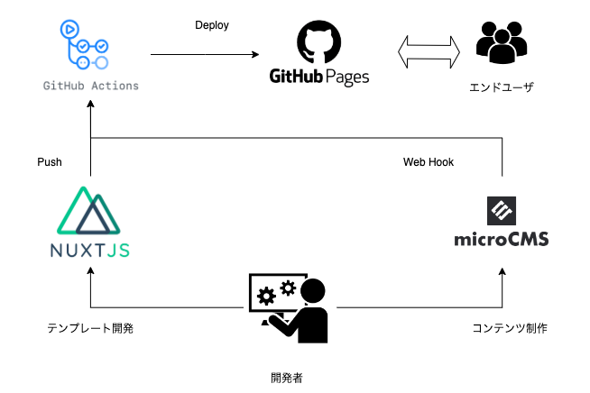
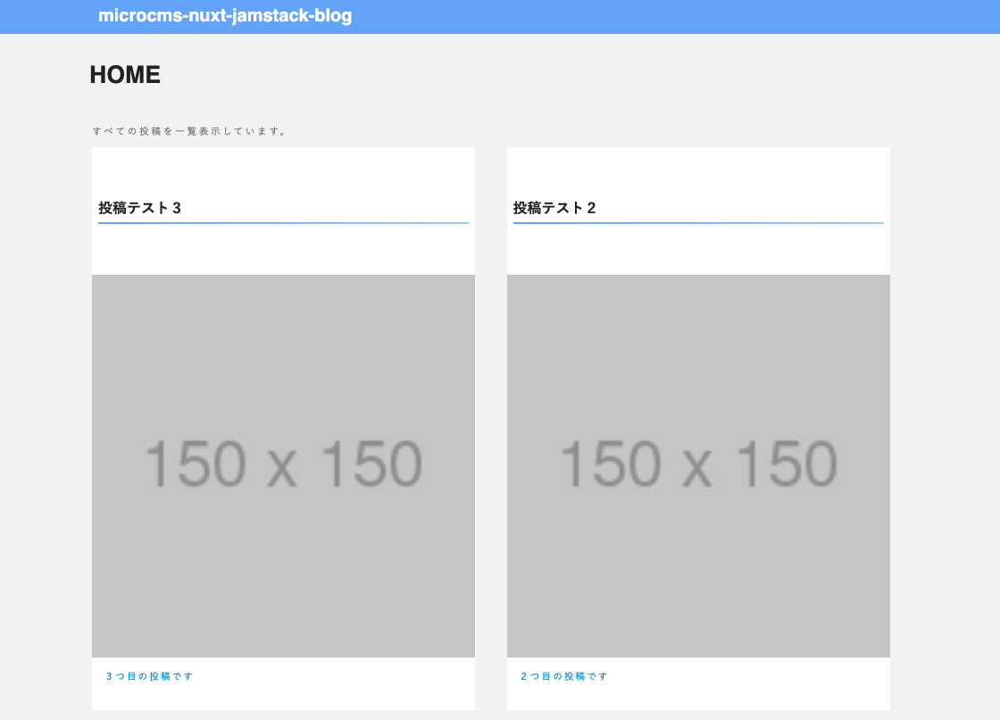
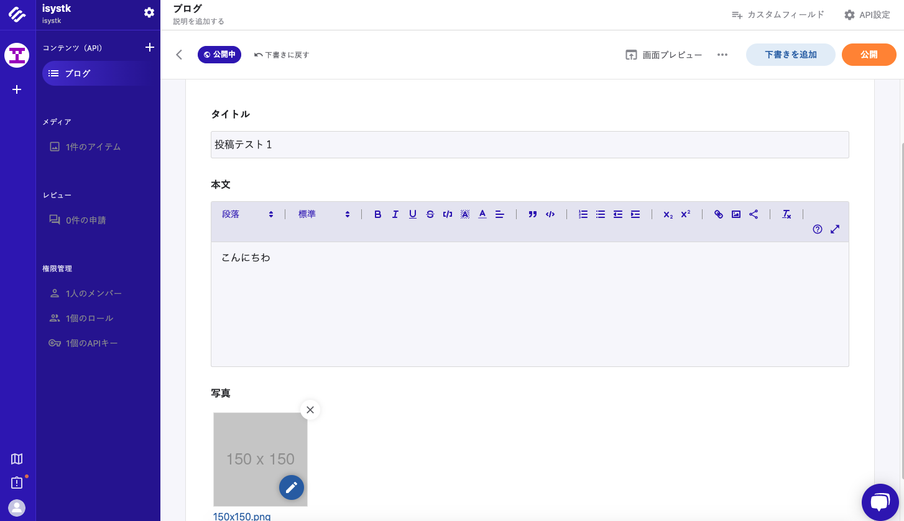
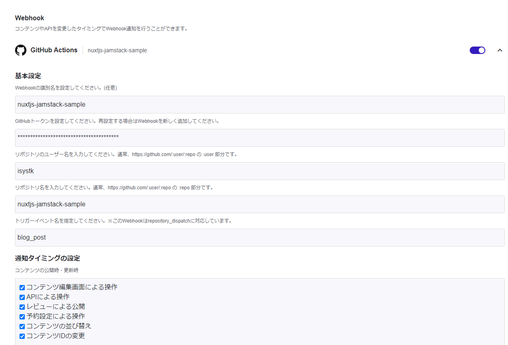

🌙 nuxtjs-jamstack-sample
====


## 📗 プロジェクトの概要

jamstackについて学習する為のサンプルアプリケーションです。
jamstackを知るためには、ここ最近のフロントエンドの仕組みを知っておく必要があります。
ここでは、CSR、SSR、SSG、ISR の仕組みについて抑えた上で、
jamstackと呼ばれる構成とその仕組について学習します。

## CSRとは
Client Side Renderingの略称で日本語に直すと、クライアント側でのレンダリングのことで、SPAとも呼ばれているものです。
クライアント側で初回ページアクセス時にサーバーに対してリクエストを送り、最小限のHTMLファイルのみを受け取ります。
その時に、ブラウザ上でAPIを叩くことで、APIからのレスポンスをもとに初期表示との差分を更新してDOMを構築し、クライアント側でレンダリングを行いページが表示されます。
#### メリット
- ページ遷移が高速（ページ毎にリクエストを送らないため）
- ビルド済みのHTMLとJSファイルがホスティングサーバーにあれば動く
#### デメリット
- クライアント側の負担が大きい（クライアントごとの性能に依存する）
- 初期ローディングは時間がかかる（ブラウザ上でJSを実行する時間）
- SEOで不利な可能性もある（初期状態はほぼ何もないHTMLファイルが返却されるため、Googleのクローラーが中身のコンテンツを認識できない可能性があるため。ただクローラーはJSを実行してから中身を解析してくれる、という話もあるので単純にSEOに不利だとも断言はできない）


## SSRとは
Server Side Renderingの略称で日本語に直すと、サーバー側でのレンダリング（HTML生成）される仕組みです。
先程とは違ってこちらは初回にブラウザ上でレンダリングするのではなく、サーバー側でAPIを叩き、レンダリングを行ってからHTMLファイルを返却します。
#### メリット
- 初回のページ表示が早い（ブラウザ上で初回レンダリングを行わないので）
- SEOに有利（SPAのデメリットの点を参照）
#### デメリット
- Node.jsサーバを実行できる環境が必要（NextやNuxtなどのフレームワークを利用可能）
- サーバ側の負荷が大きくなる

## SSGとは
Static Site Generatorの略称で日本語に直すと、静的サイト生成をする仕組みになります。
アプリのビルド時にAPIからデータ取得をして、HTMLファイルをファイルを生成する。
サーバへリクエストがあると、ビルド時に生成したHTMLファイルをファイルを返却する。
#### メリット
- 静的サイトを配信するので、パフォーマンスが向上
- HTMLとJSファイルのみがホスティングサーバーにあれば、ページ配信が可能
#### デメリット
- ページの更新時には全ファイルを再ビルドする必要がある
- ページ数が大きい大規模なアプリには不向き（データの更新毎に再ビルドを行う）

## ISRとは
Incremental Static Regenerationの略称で日本語に直すと、段階的に静的サイトを生成する仕組みになります。
基本的にはSSGの挙動と同じなのですが、SSGでページの更新時にアプリ全体を再ビルドしなくてはいけないというデメリットを解消してくれる仕組みになります。
クライアント側のリクエストに対しビルド時に生成された静的ページを返し、 尚且、バックグラウンドで一定期間ごとに静的ページの再生成をサーバー側で行う。
#### メリット
- SSGの高速性を保ったままデータの更新にも対応できる
- 再生成の際に速度が低下しない
#### デメリット
- データ更新のリアルタイム性は低い
- データの整合性が必要なものには不向き


## [Jamstack](https://jamstack.org/)とは

- JamstackのJamはJavaScript/APIs/Markupの頭文字です
- JavaScriptでAPIをたたいてMarkupを配信することを意味しています
- Jamstackの特徴としてパフォーマンスの高さとセキュリティの高さがうたわれています
- Jamstackを実現する仕組みとして、HeadressCMSやISRの技術が用いられます。



### 利用している技術

- Nuxt.js
- Typescript
- Tailwind CSS
- Firebase Hosting
- Github Actions
- MicroCMS

## 🌐 Demo

https://nuxtjs-jamstack-sample.web.app



## 🖊️ 記事の投稿
[MicroCMS](https://isystk.microcms.io/apis/blog)




記事を投稿した際に`GithubAction`に連携して静的サイトを生成させてFirebaseのHostingにデプロイしています。




## 🔧 開発環境の構築
```
$ yarn
$ yarn dev
```

## 📦 静的サイトの生成手順
```
$ yarn generate
$ yarn start
```

## 💬 Firebaseへのデプロイ手順
```
$ npm install -g firebase-tools
$ firebase login
（Firebase Hosting未設定の場合）
$ firebase init hosting
（Firebase Hosting設定済の場合）
$ firebase init hosting:github
$ firebase deploy

https://nuxtjs-jamstack-sample.web.app

`FIREBASE_TOKEN` の確認
$ firebase login:ci

GithubプロジェクトのActions secrets から、「FIREBASE_TOKEN」の変数名で上記のトークンを追加する。
```


## 🎨 参考

| プロジェクト| 概要|
| :---------------------------------------| :-------------------------------|
| [microCMS + NuxtでJamstackブログを作ってみよう](https://blog.microcms.io/microcms-nuxt-jamstack-blog/)| microCMS + NuxtでJamstackブログを作ってみよう|
| [Nuxt.js + microCMS + Firebase + GitHub Actions で JAMstack なブログに移行した](https://ryo620.org/post/jamstack-blog/)| Nuxt.js + microCMS + Firebase + GitHub Actions で JAMstack なブログに移行した|

## 🎫 Licence

[MIT](https://github.com/isystk/nuxtjs-jamstack-sample
/blob/master/LICENSE)

## 👀 Author

[isystk](https://github.com/isystk)


